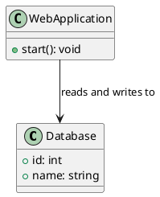
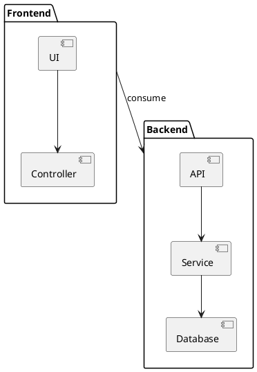

# Documentación del Proyecto

## Introducción

Este proyecto se basa en una arquitectura de microservicios y proporciona las funcionalidades para [descripción breve del sistema]. A continuación, se presentan los detalles clave de la solución, incluyendo diagramas que ilustran el diseño y la estructura del sistema.

## Generación de Diagramas con PlantUML

Para ayudar a comprender la arquitectura y los componentes del sistema, utilizamos **PlantUML**, una herramienta que permite generar diagramas a partir de texto. A continuación, se presentan ejemplos de cómo utilizar PlantUML para representar visualmente los componentes y la interacción del sistema.

### Ejemplo de Diagrama de Arquitectura



El código anterior genera un diagrama simple con una clase `Database` y una `WebApplication` que se comunica con la base de datos.

### Generación de Diagramas PlantUML

Si deseas generar y visualizar estos diagramas en tu máquina local, sigue estos pasos:

1. **Instala PlantUML**:

   - Puedes instalar PlantUML usando [Homebrew](https://brew.sh/) en macOS/Linux:

     ```bash
     brew install plantuml
     ```

   - O descargar el archivo JAR de [PlantUML](http://plantuml.com/).

2. **Genera el diagrama**:

   Guarda el código PlantUML en un archivo `.puml` y luego genera la imagen correspondiente con el siguiente comando:

   ```bash
   plantuml archivo.puml
   ```

3. **Genera imágenes automáticamente**:

   PlantUML también puede integrarse en tu editor de código favorito, como VS Code, para generar diagramas de manera instantánea.

### Agregar Diagramas en el Proyecto

Puedes agregar los diagramas generados como imágenes dentro del repositorio para visualizarlos fácilmente. Por ejemplo:


> **Nota:** Para que los diagramas generados con PlantUML se visualicen correctamente en plataformas como GitHub, debes asegurarte de que el archivo generado esté en formato PNG, SVG o JPG.

## Otros Diagramas

### Diagrama de Componentes

A continuación se muestra un ejemplo de un diagrama de componentes en PlantUML:



Este diagrama describe la comunicación entre la interfaz de usuario y el backend a través de un API.
