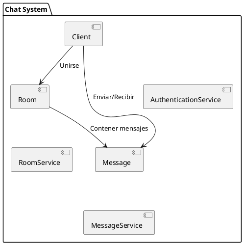
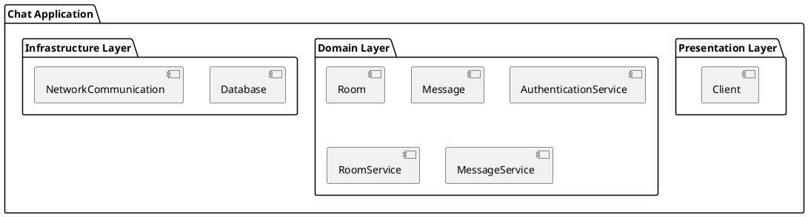
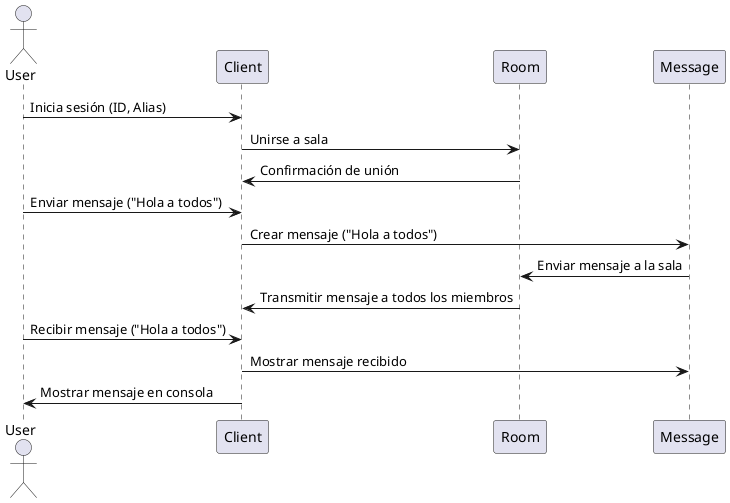
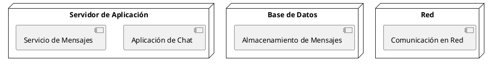
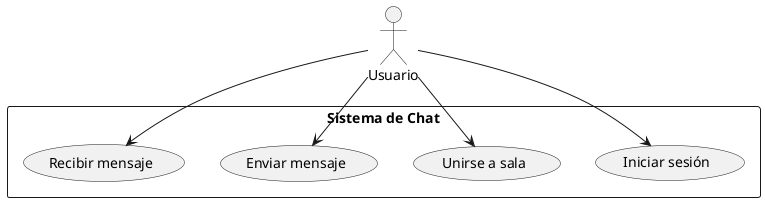

# **Documentación de Arquitectura - Sistema de Chat**

## **1. Introducción**

Este documento describe la arquitectura de un sistema de chat desarrollado en consola. El sistema está diseñado para permitir a los usuarios enviar y recibir mensajes en tiempo real. El diseño sigue los principios de **arquitectura limpia** y **código limpio**, asegurando un sistema modular, escalable y mantenible.

La arquitectura se presenta utilizando el modelo **4+1 vistas**, proporcionando una representación completa desde diferentes perspectivas clave: Lógica, Desarrollo, Proceso, Física y Casos de Uso.

---

## **2. Vista Lógica**

### **2.1 Descripción General**

La **Vista Lógica** describe los componentes principales del sistema y cómo interactúan entre sí a un nivel abstracto. El sistema está compuesto por los siguientes componentes principales:

- **Client**: Representa al cliente que interactúa con el sistema de chat a través de la interfaz de consola.
- **Room**: Gestiona las salas de chat donde los usuarios pueden interactuar y compartir mensajes.
- **Message**: Representa los mensajes enviados entre los usuarios.
- **AuthenticationService**: Servicio para la verificación de identidad de los usuarios.
- **RoomService**: Servicio encargado de la gestión de las salas.
- **MessageService**: Servicio encargado de crear, distribuir y almacenar los mensajes.

### **2.2 Diagrama de Componentes**

---

## **3. Vista de Desarrollo**

### **3.1 Descripción General**

La **Vista de Desarrollo** describe cómo se organiza el código en módulos y clases dentro del sistema. Los componentes principales están organizados en diferentes capas para separar las preocupaciones y seguir el principio de la **arquitectura limpia**:

- **Capa de Presentación**: Interfaz de usuario (Client)
- **Capa de Dominio**: Lógica de negocio (Room, Message, Services)
- **Capa de Infraestructura**: Comunicación, almacenamiento, etc.

### **3.2 Diagrama de Paquetes**

---

## **4. Vista de Proceso**

### **4.1 Descripción General**

La **Vista de Proceso** muestra cómo los componentes interactúan en tiempo de ejecución. Los procesos clave incluyen la **autenticación**, la **unión a una sala**, el **envío de mensajes** y la **distribución de mensajes** a los usuarios conectados.

### **4.2 Diagrama de Secuencia**

---

## **5. Vista Física**

### **5.1 Descripción General**

La **Vista Física** describe cómo se distribuyen los componentes a través de la infraestructura física, como servidores, bases de datos, redes y otros recursos de hardware.

### **5.2 Diagrama de Implementación**

---

## **6. Vista de Casos de Uso**

### **6.1 Descripción General**

La **Vista de Casos de Uso** describe cómo los usuarios interactúan con el sistema de chat. Los casos de uso incluyen la **autenticación de usuario**, la **unión a una sala**, el **envío y la recepción de mensajes**.

### **6.2 Diagrama de Casos de Uso**

---

## **7. Consideraciones Técnicas**

- **Escalabilidad**: El sistema se puede escalar fácilmente para agregar más salas o usuarios conectados simultáneamente.
- **Persistencia**: Los mensajes no se almacenan en una base de datos, pero esto puede implementarse para una mayor persistencia.
- **Seguridad**: El sistema utiliza un **AuthenticationService** básico, pero se pueden integrar soluciones más complejas como JWT o OAuth.

## **8. Tecnologías Utilizadas**

- **Lenguaje de Programación**: C#
- **Interfaz de Usuario**: Consola (CLI)
- **Patrones de Diseño**: Arquitectura Limpia, Patrón de Repositorio, Patrón de Servicio.
- **Tecnologías de Comunicación**: TCP/IP o una implementación similar para la comunicación en red.
